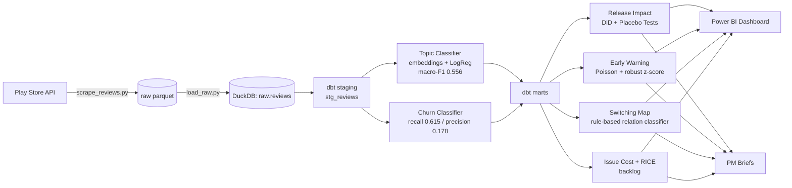
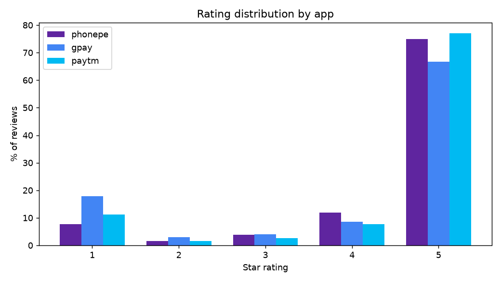
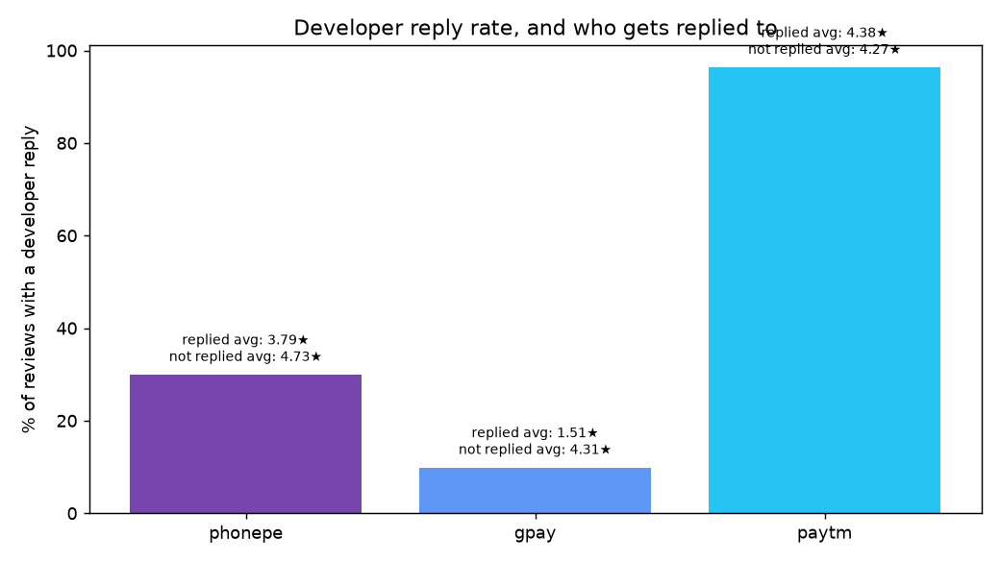
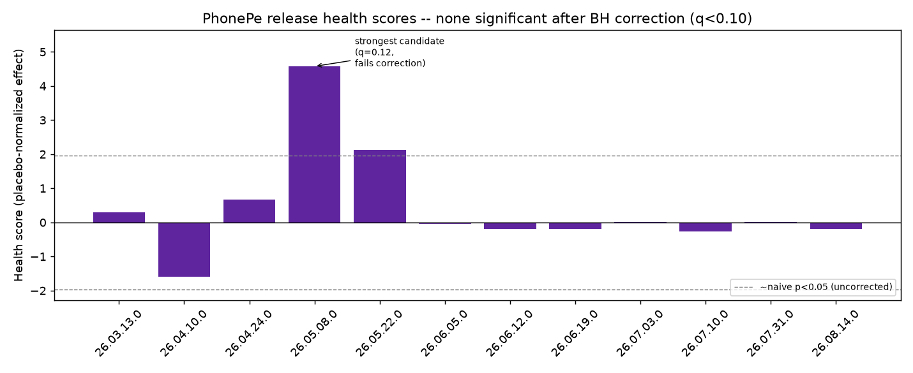
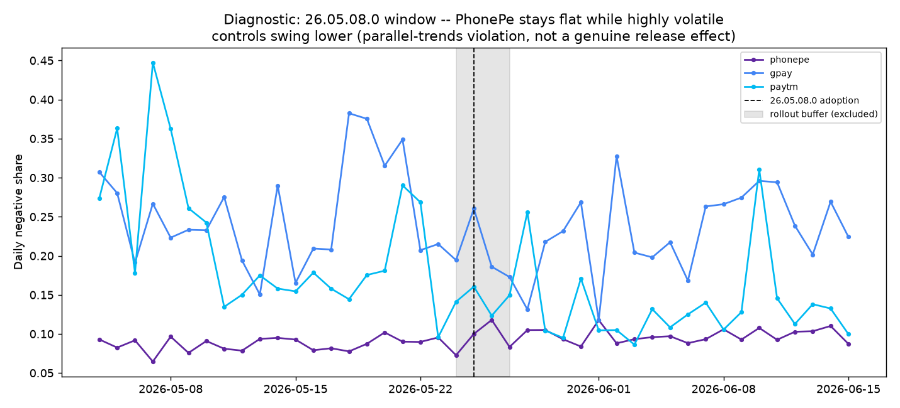
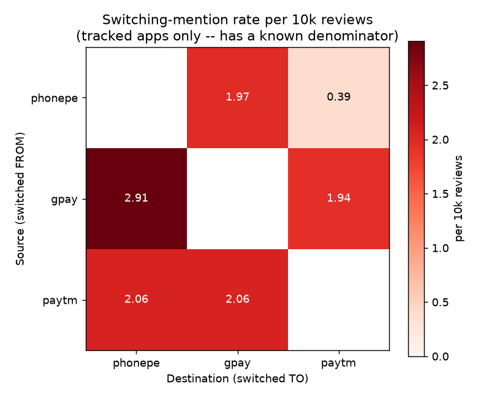
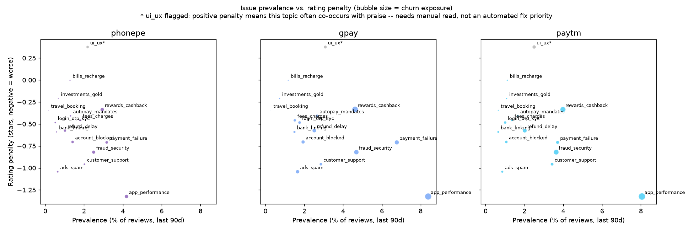

# ReleaseRadar

**Competitive product intelligence from 291K+ Play Store reviews across PhonePe, Google Pay, and Paytm** — a rigor-first analytics pipeline that measures whether product releases actually caused sentiment changes, detects outages early, maps competitive switching, and prioritizes fixes by business cost.

📄 [Methodology](reports/methodology.md) · 📝 [Decision Log](reports/decision_log.md) · 📊 [Power BI Build Guide](dashboards/POWERBI_BUILD_GUIDE.md) · 📋 [Project Charter](reports/project_charter.md)

---

## TL;DR — Key Findings

1. **🔬 Rigor over a good story:** competitor-controlled causal analysis of 12 PhonePe releases found **0 significant after correcting for multiple testing** — including the one that looked like a slam-dunk finding (health score 4.6, p=0.01) until a second method and a look at the control apps showed it was a statistical artifact, not a real release effect. Reported as the headline result, not buried.
2. **🔀 PhonePe is winning the switching war:** among the three tracked apps, PhonePe is the **net beneficiary** of stated brand switching — gaining from both Google Pay (+0.94 mentions/10k reviews) and Paytm (+1.66/10k). Both inbound flows are dominated by **app crashes/performance complaints** on the app being left, not pricing or rewards.
3. **🛠️ One issue dominates the fix backlog:** `app_performance` is the **#1 RICE-ranked issue for all 3 apps independently**, and stays #1 in **99-100% of Monte Carlo scenarios** testing effort-estimate uncertainty — the most statistically robust finding in the whole project.
4. **📞 Wildly different customer-support strategies, found with zero modeling:** Paytm replies to **96.3%** of all reviews regardless of rating (blanket/templated); Google Pay replies to only **9.8%** but targets it precisely — replied-to reviews average **1.51★** vs. **4.31★** for the rest, clear evidence of triage.
5. **🚨 Early warning works, but speed has a real cost:** validated against the one independently-confirmed outage in the data window, the detector correctly flagged the incident — but using realistic batch-processing latency, it would have **lagged the public news report by 45 minutes**, a direct consequence of the wider time-bin needed for a lower-volume app.

---

## The Business Problem

Product teams at UPI payment apps get thousands of reviews a day but have no systematic way to know: which releases actually hurt users (vs. just correlate with bad luck), whether an outage is brewing before Twitter finds out, who they're losing users to and why, or which of a hundred complaints to fix first. This project builds and validates a full pipeline to answer all four — end to end, from a raw scrape to a prioritized backlog.

## Data & Scale

| App | Reviews | History | Role |
|---|---|---|---|
| **PhonePe** | 101,600 | ~6 months (2026-03 to 2026-09) | Focus app |
| **Google Pay** | 82,600 | ~16.5 months (2025-05 to 2026-09) | Competitor / control |
| **Paytm** | 107,000 | ~11 months (2025-10 to 2026-09) | Competitor / control |
| **Total** | **291,200** | | |

Collected via the Play Store's review API (anonymized — reviewer names are SHA-256 hashed, never stored raw). Unequal history windows aren't a bug: the Play Store's own pagination caps out at roughly the same *page count* regardless of app velocity, so a high-volume app (PhonePe, ~550 reviews/day) reaches that ceiling in months while a lower-volume app (Google Pay, ~165/day) reaches back over a year.

## Architecture



**Stack:** Python (pandas, scikit-learn, sentence-transformers, statsmodels, scipy), DuckDB, dbt, Power BI, matplotlib.

## Methods & Validation

Every analysis here is built to be checked, not just trusted:

| Component | Validation | Result |
|---|---|---|
| **Topic classifier** | Trained on 374 examples (dev + keyword-guided rare-topic boost), evaluated on a held-out 450-review test set | Macro-F1 **0.556** (up from 0.392 before the rare-topic boost fix). Per-topic reliability documented — weakest topics flagged, not hidden in a blended average. |
| **Churn-intent classifier** | Same held-out test set | Recall 0.615 / precision 0.178 — deliberately tuned to catch more true signal at the cost of false positives. |
| **Release impact** | Competitor-controlled DiD + placebo tests (adapted design — the roadmap's original placebo buffer left zero candidate dates given PhonePe's release cadence) + Benjamini-Hochberg correction + a second, independent corroborating method | **0 of 12 releases significant.** The top candidate was investigated further and traced to a parallel-trends violation, not a real effect. |
| **Early warning** | Validated against the one confirmed, multi-sourced, in-window incident found after extensive research | Detector correctly alerted; realistic latency meant it lagged the public report by 45 minutes. |
| **Switching classifier** | Hand-validated on a 183-review stratified sample | ~85-95% precision; recall gaps identified and partially fixed (documented as a lower bound, not exhaustive). |
| **Human-vs-AI label check** | 120-review blind spot-check, sampled from the classifier's test split | **Pending** — packet built, scoring script ready; classifier accuracy above is currently self-reported against AI-assisted gold labels, not yet independently confirmed. |

Full reasoning trail — including every dead end, bug caught, and redesign — is in the [decision log](reports/decision_log.md).

## Dashboard

Star schema (4 dimensions + 7 fact tables) built and tested in dbt (**74/74 checks pass**); all tables exported and a full build guide (relationships, DAX measures, page-by-page spec) is ready in [`dashboards/POWERBI_BUILD_GUIDE.md`](dashboards/POWERBI_BUILD_GUIDE.md). *(Power BI Desktop's report canvas has no scriptable interface, so final visual assembly is a manual — but fully specified — step.)*

## Key Figures

| | |
|---|---|
|  |  |
| J-shaped rating distribution across all 3 apps | Wildly different developer-reply strategies |
|  |  |
| 0/12 releases significant after correction | Why the top candidate wasn't real: control apps moved, PhonePe didn't |
|  |  |
| PhonePe is the net beneficiary of switching | `app_performance` dominates the fix backlog for every app |

*(All 15 figures in [`reports/figures/`](reports/figures/).)*

## Recommendations

- **Product (PhonePe):** `app_performance` is the highest-RICE, most statistically stable fix priority — robust to effort-estimate uncertainty in 99%+ of simulated scenarios. Fix this before anything else in the backlog.
- **Growth/Retention:** the switching data suggests PhonePe's edge over Google Pay and Paytm is real but fragile — both inbound flows cite the *same* reason (app performance) that's also PhonePe's own #1 issue. A performance regression risks reversing the net-inflow advantage, not just hurting PhonePe's own ratings.
- **SRE/Reliability:** the early-warning system works as a case study, but a wider detection bin (needed for lower-volume apps) has a real speed cost — before relying on this for on-call paging, either accept the latency trade-off explicitly or invest in a data source with less collection lag than the public review API.
- **Data Science process:** the release-impact null result is the most important recommendation of all — it shows that *without* placebo testing, multiple-testing correction, and a corroborating method, this exact pipeline would have shipped a false positive. Keep all three checks in place for any future causal claim from this data.

## Limitations

- **Review-based sampling is not representative of all users** — reviews skew toward the delighted and the furious. Metrics here are signals from the reviewing population, not population-wide estimates.
- **~24-25h indexing lag** in the Play Store's review API (found in Phase 1) means the trailing ~2 days of data are always incomplete — every daily-aggregation model in this project explicitly flags and excludes them (`is_complete_day`), after this exact issue silently corrupted two early models before being caught.
- **Incident ground truth is thin** — despite extensive research, only one independently-confirmed outage falls inside any app's actual data-collection window. Early-warning results are a validated case study, not a statistically powered recall estimate.
- **Switching and relation classification are rule-based**, not ML — validated at good precision but incomplete recall (particularly for Hindi/Hinglish phrasing), so switching counts are a lower bound.
- **RICE "Reach" uses Play Store download counts**, not true MAU (unavailable reliably) — sound for within-app prioritization, not for comparing RICE scores across apps of different sizes.
- **English + Hinglish only** — reviews in other scripts/languages are outside this classifier's effective coverage.

## How to Reproduce

```powershell
python -m venv .venv
.\.venv\Scripts\Activate.ps1
pip install -r requirements.txt

# Scrape (see config/apps.yaml)
python src/scrape/scrape_reviews.py
python src/load/load_raw.py

# dbt
cd dbt/releaseradar
dbt build --profiles-dir .

# Full phase-by-phase pipeline: see ROADMAP.md
```

See [`ROADMAP.md`](ROADMAP.md) for the complete 10-phase build plan this project followed, and [`reports/decision_log.md`](reports/decision_log.md) for the reasoning behind every non-obvious choice.

## Tech Stack

Python · pandas · scikit-learn · sentence-transformers (multilingual) · statsmodels · SciPy · DuckDB · dbt · Power BI · matplotlib · BERTopic

---

*Built as a portfolio project demonstrating end-to-end analytics engineering: data collection, SQL/dbt modeling, NLP classification, causal inference, anomaly detection, and business prioritization — with an explicit focus on validating every claim rather than presenting the most flattering number.*
