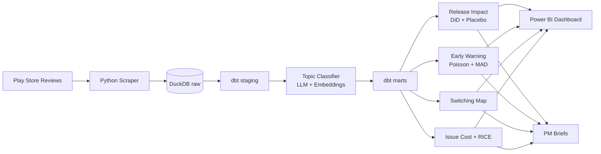

# ReleaseRadar — Complete Project Roadmap

> **Competitive product intelligence from app reviews.**
> An analytics system that turns hundreds of thousands of Play Store reviews into findings someone can act on: which releases hurt users, when outages start, who is losing users to whom, and what to fix first.

**Scope of this roadmap:** the core pipeline + all four Tier 1 upgrades + upgrade #7.

| # | Component | Question it answers |
|---|---|---|
| Core | Release impact analysis | *Did this release make users happier or angrier, and can we prove it?* |
| T1-1 | Early-warning system (checked against real incidents) | *Can reviews detect an outage before the news does?* |
| T1-2 | Brand-switching map | *Who is losing users to whom, and why?* |
| T1-3 | Issue cost + RICE backlog | *What should the product team fix first?* |
| T1-4 | Model accuracy checks + placebo tests | *Why should anyone trust these numbers?* |
| #7 | SQL warehouse (DuckDB + dbt) + Power BI | *Can a stakeholder explore this without Python?* |

**Total effort:** about 7 weeks at 15–20 hrs/week (about 120 hours).

---

## Table of Contents

0. [Before You Start: Principles](#0-before-you-start-principles)
1. [Phase 0 — Scoping & Setup (Days 1–4)](#phase-0--scoping--setup-days-14)
2. [Phase 1 — Data Collection (Week 1)](#phase-1--data-collection-week-1)
3. [Phase 2 — Warehouse & dbt Staging Layer (Week 1–2)](#phase-2--warehouse--dbt-staging-layer-week-12)
4. [Phase 3 — Exploratory Data Analysis (Week 2)](#phase-3--exploratory-data-analysis-week-2)
5. [Phase 4 — Topic Taxonomy, Labeling & Classification (Week 2–3)](#phase-4--topic-taxonomy-labeling--classification-week-23)
6. [Phase 5 — Release Impact with Placebo Tests (Week 3–4)](#phase-5--release-impact-with-placebo-tests-week-34)
7. [Phase 6 — Early-Warning System (Week 4–5)](#phase-6--early-warning-system-week-45)
8. [Phase 7 — Brand-Switching Map (Week 5)](#phase-7--brand-switching-map-week-5)
9. [Phase 8 — Issue Cost & RICE Backlog (Week 5–6)](#phase-8--issue-cost--rice-backlog-week-56)
10. [Phase 9 — dbt Marts + Power BI Dashboard (Week 6)](#phase-9--dbt-marts--power-bi-dashboard-week-6)
11. [Phase 10 — Storytelling & Packaging (Week 7)](#phase-10--storytelling--packaging-week-7)
12. [Interview Preparation](#interview-preparation)
13. [Master Checklist](#master-checklist)
14. [Learning Resources](#learning-resources)

---

## 0. Before You Start: Principles

1. **Findings first, code second.** Every notebook, model and chart must end in a "so what" sentence. If it doesn't, cut it.
2. **Every number needs a way to check it.** Classifier → accuracy on hand-labeled reviews. Release effect → placebo test. Early warning → real incident log. Switching → hand-checked sample.
3. **Write assumptions down as you make them.** Keep a running `reports/decision_log.md` with entries like *"Chose a 21-day window because…"*. This becomes your interview material.
4. **Be honest about limitations.** Review data is biased (angry and delighted users post the most). Saying so openly makes you more credible, not less.
5. **Protect privacy.** Never store or publish reviewer names. Hash them on collection. Publish aggregates and short anonymized quotes only.
6. **Don't commit raw data publicly.** Commit code, the codebook, hand labels, incident log and aggregated outputs.

---

## Phase 0 — Scoping & Setup (Days 1–4)

### 0.1 Choose the category and apps

**Recommended: Fintech / UPI payments.** Why:
- **Very high review volume**, enough for daily and hourly analysis.
- **Outages are publicly reported** (UPI/NPCI outages get news coverage), which gives you real incidents to test the early-warning system against. This is the main reason.
- **Direct competitors**, so switching between apps is common and users mention it.
- **Natural events** to study, such as the RBI action on Paytm Payments Bank (Jan–Mar 2024), if your data goes back that far.

| Role | App | Play Store ID (confirm on the Play Store URL) |
|---|---|---|
| Focus app | PhonePe | `com.phonepe.app` |
| Competitor | Google Pay | `com.google.android.apps.nbu.paisa.user` |
| Competitor | Paytm | `net.one97.paytm` |
| Optional 4th | BHIM / CRED / Navi | confirm on the Play Store |

> **Confirm each ID:** open the app's Play Store page in a browser. The URL is `play.google.com/store/apps/details?id=<APP_ID>`.

**Other categories** (the method is the same; only the early-warning incident log gets harder to build):
- Quick commerce (Blinkit, Zepto, Instamart): incidents are sale-day crashes and delivery disruptions
- Trading (Zerodha Kite, Groww, Upstox): market-hours outages are well reported, so this is also a good option
- OTT (JioHotstar, Netflix): live-match streaming crashes

### 0.2 Write a one-page project charter (`reports/project_charter.md`)

This is a stakeholder-management skill that recruiters value. Template:

```markdown
# ReleaseRadar — Project Charter

## Problem
Product teams at UPI apps get thousands of reviews daily but can't tell which
releases hurt users, detect outages early, or prioritize fixes by business impact.

## Stakeholders (personas)
- Product Manager, Payments — wants release health + prioritized backlog
- Head of Reliability / SRE — wants early outage signals
- Strategy / Growth — wants competitive switching intelligence

## Key Questions
1. Which releases in the last N months significantly changed user sentiment?
2. Can review signals detect outages earlier than public reporting?
3. What share of users threaten to switch, to which competitor, and why?
4. Which issues cost the most rating/churn, and what should be fixed first?

## Success Criteria
- Topic classifier: macro-F1 ≥ 0.75 on a held-out hand-labeled set
- Early warning: detect ≥ 70% of logged incidents with ≤ 1 false alert/app/week
- Release impact: every effect reported with a placebo-based p-value
- Deliverables: Power BI dashboard, 3 PM briefs, methodology doc, README

## Out of Scope
iOS App Store, non-English reviews (documented as limitation), real-time streaming.
```

### 0.3 Environment setup (Windows)

**Install:** Python 3.11 or 3.12, Git, VS Code, Power BI Desktop (free, from the Microsoft Store), DBeaver (optional, a SQL GUI for DuckDB).

```powershell
cd D:\projects\non-tech
git init
python -m venv .venv
.\.venv\Scripts\Activate.ps1
python -m pip install --upgrade pip
```

`requirements.txt`:
```text
google-play-scraper
pandas
pyarrow
duckdb
dbt-duckdb
numpy
scipy
statsmodels
scikit-learn
sentence-transformers
plotly
matplotlib
pyyaml
tqdm
python-dotenv
jupyter
anthropic        # optional — only if you use an LLM for labeling
```

```powershell
pip install -r requirements.txt
```

> **BERTopic on Windows:** it depends on `hdbscan`, which often needs Microsoft C++ Build Tools to install. The easy option is to run the BERTopic step in **Google Colab** (free) and bring the results back. BERTopic is only used once, to discover topics, so you don't need it locally.

### 0.4 Repository structure

```text
releaseradar/  (D:\projects\non-tech)
├── README.md                     # the recruiter-facing story (Phase 10)
├── ROADMAP.md                    # this file
├── requirements.txt
├── .gitignore                    # .venv/, data/raw/, data/warehouse/, .env, *.duckdb
├── .env                          # API keys (never commit)
├── config/
│   ├── apps.yaml                 # app keys + Play Store IDs
│   ├── aliases.yaml              # competitor name variants (for switching)
│   ├── topics_codebook.md        # topic definitions (Phase 4)
│   └── incidents.csv             # ground-truth outage log (Phase 6)
├── data/
│   ├── raw/reviews/<app>/        # parquet pages from scraper (gitignored)
│   ├── labels/                   # gold hand labels (COMMIT these)
│   ├── interim/                  # classifier outputs, features
│   ├── warehouse/releaseradar.duckdb   (gitignored)
│   └── exports/                  # CSVs for Power BI
├── src/
│   ├── scrape/scrape_reviews.py
│   ├── load/load_raw.py
│   ├── classify/{sample_for_labeling.py, llm_label.py, train_classifier.py, evaluate.py}
│   └── analysis/{release_impact.py, early_warning.py, switching.py, issue_cost.py}
├── dbt/releaseradar/
│   ├── dbt_project.yml
│   ├── profiles.yml
│   └── models/{staging, intermediate, marts}/
├── notebooks/
│   ├── 01_eda.ipynb
│   ├── 02_topic_discovery.ipynb
│   ├── 03_release_impact.ipynb
│   ├── 04_early_warning.ipynb
│   ├── 05_switching.ipynb
│   └── 06_issue_cost.ipynb
├── dashboards/releaseradar.pbix
└── reports/
    ├── project_charter.md
    ├── decision_log.md
    ├── methodology.md
    ├── briefs/{phonepe.md, gpay.md, paytm.md}
    └── figures/
```

`config/apps.yaml`:
```yaml
apps:
  phonepe: { id: com.phonepe.app, display: PhonePe, focus: true }
  gpay:    { id: com.google.android.apps.nbu.paisa.user, display: Google Pay }
  paytm:   { id: net.one97.paytm, display: Paytm }
scrape:
  lang: en
  country: in
  batch_size: 200
  sleep_seconds: 1.0
  max_reviews_per_app: 300000
```

### ✅ Phase 0 done when
- [ ] Category and 3–4 apps chosen, IDs confirmed
- [ ] Project charter written
- [ ] Repo, venv and folder structure created; first commit pushed to GitHub
- [ ] `decision_log.md` started

---

## Phase 1 — Data Collection (Week 1)

### 1.1 Test scrape: how far back can you go?
Before a full scrape, pull about 5,000 reviews per app and check the date range. Play Store pagination has limits, and **this tells you your analysis window.** Record it in the decision log.

### 1.2 Scraper (`src/scrape/scrape_reviews.py`)

```python
import hashlib
import time
from pathlib import Path

import pandas as pd
import yaml
from google_play_scraper import Sort, reviews

CFG = yaml.safe_load(open("config/apps.yaml"))
RAW_DIR = Path("data/raw/reviews")


def anonymize(df: pd.DataFrame) -> pd.DataFrame:
    df["user_hash"] = df["userName"].astype(str).map(
        lambda u: hashlib.sha256(u.encode()).hexdigest()[:16]
    )
    return df.drop(columns=["userName", "userImage"], errors="ignore")


def scrape_app(app_key: str, app_id: str) -> None:
    s = CFG["scrape"]
    out_dir = RAW_DIR / app_key
    out_dir.mkdir(parents=True, exist_ok=True)
    run_id = pd.Timestamp.now().strftime("%Y%m%d_%H%M")

    token, total, page = None, 0, 0
    while total < s["max_reviews_per_app"]:
        try:
            batch, token = reviews(
                app_id,
                lang=s["lang"],
                country=s["country"],
                sort=Sort.NEWEST,
                count=s["batch_size"],
                continuation_token=token,
            )
        except Exception as e:  # network hiccups: back off and retry
            print(f"[{app_key}] error: {e}; sleeping 30s")
            time.sleep(30)
            continue

        if not batch:
            break

        df = anonymize(pd.DataFrame(batch))
        df["app_key"] = app_key
        df["scraped_at"] = pd.Timestamp.now()
        df.to_parquet(out_dir / f"{run_id}_p{page:05d}.parquet", index=False)

        total += len(df)
        page += 1
        if page % 25 == 0:
            print(f"[{app_key}] {total:,} reviews, oldest = {df['at'].min()}")

        if getattr(token, "token", None) is None:
            break
        time.sleep(s["sleep_seconds"])


if __name__ == "__main__":
    for key, meta in CFG["apps"].items():
        scrape_app(key, meta["id"])
```

**Important details:**
- **Save each page as it comes in.** If the script crashes at review 180k, you keep what you already have.
- **Weekly refresh:** re-run each week. Duplicates are removed later in dbt by `reviewId`. For the early-warning system, a weekly re-scrape keeps building history beyond what the Play Store will return later. You can automate it with Windows Task Scheduler.
- **Be polite to the servers:** use the sleep between pages and don't run the apps in parallel.
- **Fields you get:** `reviewId, content, score, thumbsUpCount, reviewCreatedVersion, at, replyContent, repliedAt, appVersion`.

### 1.3 Load raw data into DuckDB (`src/load/load_raw.py`)

```python
import duckdb

con = duckdb.connect("data/warehouse/releaseradar.duckdb")
con.execute("CREATE SCHEMA IF NOT EXISTS raw")
con.execute("""
    CREATE OR REPLACE TABLE raw.reviews AS
    SELECT * FROM read_parquet('data/raw/reviews/*/*.parquet', union_by_name = true)
""")
print(con.execute("SELECT app_key, COUNT(*), MIN(at), MAX(at) FROM raw.reviews GROUP BY 1").df())
```

### ⚠️ Pitfalls
- **Timezone of `at`:** check it against a known event, such as a big outage that has a news timestamp in IST. Record what you find. The early-warning lead-time figures depend on it.
- `reviewCreatedVersion` is **missing** for some reviews. Measure the share in EDA.
- The `lang="en"` filter still returns a lot of **Hinglish** (Hindi written in English letters). Plan for it in Phase 4.

### ✅ Phase 1 done when
- [ ] Coverage window per app recorded in the decision log
- [ ] 150k–300k+ reviews per app saved as parquet
- [ ] `raw.reviews` table loaded in DuckDB
- [ ] Timezone of `at` checked

---

## Phase 2 — Warehouse & dbt Staging Layer (Week 1–2)

> This is upgrade #7, part 1. The goal is to show **real SQL and data-modeling skills**, not just pandas.

### 2.1 Set up dbt

```powershell
cd dbt
dbt init releaseradar   # choose duckdb adapter
```

`dbt/releaseradar/profiles.yml` (use `--profiles-dir .` when running):
```yaml
releaseradar:
  target: dev
  outputs:
    dev:
      type: duckdb
      path: ../../data/warehouse/releaseradar.duckdb
      threads: 4
```

### 2.2 Layered model design

```text
raw (loaded by Python)
 └── staging      → clean, rename, dedupe, cast        (views)
      └── intermediate → business logic (release dates, topic joins)
           └── marts    → analysis-ready facts & dims  (tables → Power BI)
```

`models/staging/_sources.yml`:
```yaml
version: 2
sources:
  - name: raw
    schema: raw
    tables:
      - name: reviews
      - name: review_topics      # loaded from classifier output (Phase 4)
      - name: incidents          # loaded from config/incidents.csv (Phase 6)
```

`models/staging/stg_reviews.sql`:
```sql
with source as (
    select * from {{ source('raw', 'reviews') }}
),

deduped as (
    select
        *,
        row_number() over (partition by reviewId order by scraped_at desc) as rn
    from source
)

select
    reviewId                         as review_id,
    app_key,
    user_hash,
    trim(content)                    as review_text,
    cast(score as integer)           as rating,
    thumbsUpCount                    as thumbs_up,
    reviewCreatedVersion             as review_version,
    at                               as reviewed_at,
    cast(at as date)                 as review_date,
    date_trunc('hour', at)           as review_hour,
    replyContent is not null         as has_dev_reply,
    length(trim(content))            as text_length,
    rating <= 2                      as is_negative
from deduped
where rn = 1
  and content is not null
  and length(trim(content)) > 0
```

`models/staging/_stg_models.yml` (**tests are an important part of this**):
```yaml
version: 2
models:
  - name: stg_reviews
    columns:
      - name: review_id
        tests: [unique, not_null]
      - name: rating
        tests:
          - not_null
          - accepted_values: { values: [1, 2, 3, 4, 5] }
      - name: app_key
        tests:
          - accepted_values: { values: ['phonepe', 'gpay', 'paytm'] }
```

### 2.3 Intermediate model: working out release dates

The Play Store has no public version history. **Work out each release date from the reviews themselves:** a version's "adoption date" is the first day it makes up at least 5% of that app's reviews. Checking for a 5% share filters out beta testers and stray early reviews.

`models/intermediate/int_version_adoption.sql`:
```sql
with daily_version as (
    select app_key, review_date, review_version, count(*) as n
    from {{ ref('stg_reviews') }}
    where review_version is not null
    group by 1, 2, 3
),

with_share as (
    select
        *,
        n * 1.0 / sum(n) over (partition by app_key, review_date) as version_share
    from daily_version
),

first_adopted as (
    select
        app_key,
        review_version,
        min(review_date) filter (where version_share >= 0.05) as adoption_date,
        min(review_date)                                      as first_seen_date,
        sum(n)                                                as total_reviews
    from with_share
    group by 1, 2
)

select *
from first_adopted
where adoption_date is not null
  and total_reviews >= 200          -- enough reviews to analyze
order by app_key, adoption_date
```

**Check this:** compare about 10 of your inferred dates against APKMirror's version history pages. Report the typical gap (for example, "within ±2 days for 9/10 versions").

### 2.4 A daily metrics model (you'll use it constantly)

`models/marts/fct_daily_app_metrics.sql`:
```sql
select
    app_key,
    review_date,
    count(*)                                       as n_reviews,
    avg(rating)                                    as avg_rating,
    avg(case when is_negative then 1.0 else 0 end) as negative_share,
    avg(avg(rating)) over (
        partition by app_key order by review_date
        rows between 6 preceding and current row
    )                                              as avg_rating_7d
from {{ ref('stg_reviews') }}
group by 1, 2
```

```powershell
dbt run --profiles-dir .
dbt test --profiles-dir .
dbt docs generate --profiles-dir .; dbt docs serve --profiles-dir .
```

> **Screenshot the dbt lineage graph** from `dbt docs serve` and put it in your README. It shows data-modeling skill at a glance.

### ✅ Phase 2 done when
- [ ] `stg_reviews`, `int_version_adoption`, `fct_daily_app_metrics` built
- [ ] All dbt tests pass
- [ ] Inferred release dates checked against APKMirror for about 10 versions

---

## Phase 3 — Exploratory Data Analysis (Week 2)

`notebooks/01_eda.ipynb` — query DuckDB directly:

```python
import duckdb
con = duckdb.connect("data/warehouse/releaseradar.duckdb", read_only=True)
df = con.sql("select * from main.stg_reviews").df()
```

### Questions to answer (each one becomes a markdown cell with a finding)
1. **Volume:** reviews per day per app. Any gaps, spikes or collection artifacts?
2. **Rating distribution:** is it J-shaped (many 1s and 5s)? This shows the selection bias you'll discuss later.
3. **Text length:** what share of reviews are under 5 words ("worst app", "good")? These carry little topic information.
4. **Version coverage:** what share of reviews have `review_version`?
5. **Language mix:** estimate Hinglish share by labeling 200 random reviews by hand.
6. **Hour-of-day and day-of-week patterns:** needed for the early-warning baseline.
7. **Developer replies:** reply rate per app. Does rating differ for reviews that got a reply?
8. **Obvious events:** plot daily negative share and mark big spikes. You'll explain them in Phases 5 and 6.

### Deliverable
- [ ] 6–8 clean charts saved to `reports/figures/`
- [ ] "Data Quality & Coverage" section written in `methodology.md`
- [ ] 3–5 early observations logged, to be confirmed or rejected later

---

## Phase 4 — Topic Taxonomy, Labeling & Classification (Week 2–3)

> This covers **Tier 1 #4 (accuracy checks)**. Everything downstream depends on topic labels, so this phase has to be solid.

### 4.1 Discover topics with BERTopic (Colab)
Run BERTopic on a random sample of 20–30k reviews with at least 5 words. Look at the top ~40 topics and their example reviews. **This is for discovery only.** Use it to decide what your categories should be. Don't use BERTopic's output as final labels.

```python
from bertopic import BERTopic
from sentence_transformers import SentenceTransformer

emb_model = SentenceTransformer("paraphrase-multilingual-MiniLM-L12-v2")  # copes better with Hinglish
topic_model = BERTopic(embedding_model=emb_model, min_topic_size=50)
topics, _ = topic_model.fit_transform(docs)
topic_model.get_topic_info().head(40)
```

### 4.2 Write the codebook (`config/topics_codebook.md`)
A codebook gives each topic a **definition, inclusion rules, exclusion rules, and 2 examples**. Reviews can have **more than one topic**.

Starter set for UPI apps (adjust based on what BERTopic finds):

| Topic key | Definition | Example signal |
|---|---|---|
| `payment_failure` | Transaction failed, stuck pending, debited but not received | "money deducted but not received" |
| `refund_delay` | Refund or reversal not received or slow | "refund not come after 7 days" |
| `login_otp_kyc` | Login, OTP, PIN, KYC or verification problems | "OTP not coming" |
| `account_blocked` | Account frozen, suspended or restricted | "my account is blocked" |
| `bank_linking` | Can't add or link a bank account or UPI ID | "bank server not found" |
| `app_performance` | Slow, crashes, freezes, won't open | "app hangs every time" |
| `ui_ux` | Confusing design, hard to find features | "new update design is confusing" |
| `customer_support` | Can't reach support, bot-only support, unresolved tickets | "no customer care number" |
| `fraud_security` | Scam, unauthorized debit, security worries | "fraud transaction from my account" |
| `rewards_cashback` | Cashback, scratch cards, rewards complaints or praise | "no cashback anymore" |
| `fees_charges` | Platform fee, convenience fee, hidden charges | "charging fee on recharge" |
| `ads_spam` | Too many ads, notifications or promotions | "too many notifications" |
| `bills_recharge` | Bill payment or recharge problems | "recharge failed" |
| `general_praise` | Positive with no specific topic | "very good app" |
| `uninformative` | Too short or vague to classify | "bad", "ok" |

**Separate flags (not topics):**
- `churn_intent` (yes/no): the user says they are uninstalling, leaving or switching.
- `competitor_mentioned`: used in Phase 7.

### 4.3 Build the hand-labeled test set ("gold set")
1. **Sample 600 reviews, stratified** by app × rating (1–2 / 3 / 4–5) and slightly weighted toward longer reviews (`src/classify/sample_for_labeling.py`).
2. **Label them yourself** in Excel or Google Sheets, with one column per topic (0/1) plus `churn_intent`. Expect this to take about 8–10 hours. **This is the most valuable work in the project.**
3. **Check your own consistency:** a week later, relabel 100 of them without looking at your first labels. Calculate **Cohen's kappa** per topic. Better still, ask a friend to label the same 100. Kappa ≥ 0.7 is good. Low-kappa topics mean the definition is unclear, so fix the codebook.
4. **Split:** 150 reviews for **development** (tune prompts and thresholds on these) and 450 for **final testing** (**don't look at results on these until the end**).

```python
from sklearn.metrics import cohen_kappa_score
for t in TOPICS:
    print(t, round(cohen_kappa_score(round1[t], round2[t]), 2))
```

### 4.4 Classify all reviews (a cost-aware approach)

Running an LLM on 500k+ reviews is expensive. **Use this three-step approach:**

```text
Step A: LLM labels ~5,000 stratified reviews  (cheap, fast)
Step B: Train a lightweight classifier on those labels
        (sentence-transformer embeddings + logistic regression per topic)
Step C: Apply Step B to all reviews  (free, runs locally)
Test BOTH the LLM and the Step B classifier on the same 450-review test set.
```

**Zero-budget option:** skip the LLM, hand-label about 1,500 reviews instead, and train Step B on those.

**Step A — LLM labeling** (`src/classify/llm_label.py`). Use a cheap, fast model (for example `claude-haiku-4-5`) and a **batch API** for bulk jobs. Check current pricing and estimate total cost before running, then note it in the decision log.

Prompt structure:
```text
You are classifying Google Play reviews of a UPI payments app.

Topics (multi-label; use only these keys):
<paste codebook: key — definition — include/exclude rules>

Rules:
- Return every topic that applies; return ["uninformative"] if none can be determined.
- churn_intent = true only if the user states they are uninstalling, leaving, or switching.
- Reviews may be in Hinglish; interpret meaning, not just English keywords.

Return ONLY JSON:
{"topics": ["..."], "churn_intent": true|false, "competitor_mentioned": "<name or null>"}

Review: """{review_text}"""
```

Tune the prompt on the **150 development reviews only.**

**Step B — train the classifier** (`src/classify/train_classifier.py`):
```python
import numpy as np
from sentence_transformers import SentenceTransformer
from sklearn.linear_model import LogisticRegression
from sklearn.multiclass import OneVsRestClassifier
from sklearn.preprocessing import MultiLabelBinarizer

enc = SentenceTransformer("paraphrase-multilingual-MiniLM-L12-v2")
X_train = enc.encode(train_texts, batch_size=256, show_progress_bar=True)

mlb = MultiLabelBinarizer(classes=TOPICS)
Y_train = mlb.fit_transform(train_topic_lists)

clf = OneVsRestClassifier(LogisticRegression(max_iter=2000, class_weight="balanced"))
clf.fit(X_train, Y_train)

# Tune one threshold per topic on the DEV set to maximize F1
probs_dev = clf.predict_proba(enc.encode(dev_texts))
thresholds = {}
for i, t in enumerate(TOPICS):
    grid = np.linspace(0.1, 0.9, 17)
    f1s = [f1_score(Y_dev[:, i], probs_dev[:, i] >= g) for g in grid]
    thresholds[t] = grid[int(np.argmax(f1s))]
```

**Evaluation** (`src/classify/evaluate.py`):
```python
from sklearn.metrics import classification_report
print(classification_report(Y_test, Y_pred, target_names=TOPICS, zero_division=0))
```

### 4.5 Report it as a results table (goes in README and methodology)

| Model | Micro-F1 | Macro-F1 | Cost per 10k reviews | Runtime |
|---|---|---|---|---|
| LLM (zero/few-shot) | … | … | … | … |
| Embeddings + LogReg (trained on LLM labels) | … | … | ≈ ₹0 | … |

Also report **per-topic precision and recall**. If a topic's F1 is below about 0.6, merge it into another topic or mark it "low confidence". Phase 8 uses these scores.

### 4.6 Load the results back into the warehouse
Save as `raw.review_topics` (review_id, topic, probability) in long format (one row per review–topic pair), plus `raw.review_flags` (review_id, churn_intent, competitor_mentioned). Then build:

`models/marts/fct_daily_topic_metrics.sql`:
```sql
select
    r.app_key,
    r.review_date,
    t.topic,
    count(distinct r.review_id)                                     as n_topic_reviews,
    avg(r.rating)                                                   as avg_rating_topic,
    avg(case when f.churn_intent then 1.0 else 0 end)               as churn_intent_rate
from {{ ref('stg_reviews') }} r
join {{ ref('stg_review_topics') }} t using (review_id)
left join {{ ref('stg_review_flags') }} f using (review_id)
group by 1, 2, 3
```

### ✅ Phase 4 done when
- [ ] Codebook written, with definitions checked against BERTopic output
- [ ] 600 reviews hand-labeled; kappa reported
- [ ] LLM and trained classifier both evaluated on the 450-review test set
- [ ] All reviews classified; topic tables in DuckDB; dbt tests pass

---

## Phase 5 — Release Impact with Placebo Tests (Week 3–4)

> Core analysis + **Tier 1 #4 (placebo tests)**. The goal is to show that a release *caused* a change in sentiment, not that it just happened at the same time as one.

### 5.1 Why a simple before/after comparison isn't enough
Sentiment changes for many reasons unrelated to the release: salary-day spikes, festival transaction volume, category-wide UPI outages. A simple before/after comparison mixes all of these with the release effect.

### 5.2 Main method: competitor-controlled difference-in-differences

For each release *r* of the focus app, with adoption date *d*:
- **Window:** 21 days before and 21 days after. **Drop days d−1 to d+2**, because the rollout is still under way.
- **Treated group:** the app that shipped the release. **Control group:** the competitor apps, which were affected by the same market-wide shocks but didn't ship this release.
- **Outcome:** daily `negative_share` (more stable than mean rating). Repeat for the top topic shares.

Model:

$$y_{a,t} = \alpha_a + \gamma_t + \beta \cdot (\text{Treated}_a \times \text{Post}_t) + \varepsilon_{a,t}$$

`α_a` = app fixed effect, `γ_t` = date fixed effect (absorbs market-wide shocks), **β = the release effect.**

```python
import statsmodels.formula.api as smf

def release_effect(panel, focus_app, adoption_date, window=21, outcome="negative_share"):
    d = pd.Timestamp(adoption_date)
    p = panel[(panel.review_date >= d - pd.Timedelta(days=window)) &
              (panel.review_date <= d + pd.Timedelta(days=window))].copy()
    p = p[~p.review_date.between(d - pd.Timedelta(days=1), d + pd.Timedelta(days=2))]
    p["treated"] = (p.app_key == focus_app).astype(int)
    p["post"] = (p.review_date > d).astype(int)
    m = smf.wls(f"{outcome} ~ treated:post + C(app_key) + C(review_date)",
                data=p, weights=p["n_reviews"]).fit()
    return m.params["treated:post"]
```

### 5.3 Supporting method: comparing old and new versions during rollout
During a staged rollout, old and new versions are live **on the same days**. Compare the ratings of reviews from version N with version N−1 **on those overlapping days**. This controls for time, although early updaters may differ from other users, so mention that caveat. If both methods point the same way, confidence is higher.

### 5.4 Placebo tests (the core of Tier 1 #4)

**The idea:** run the same method on **fake release dates** when nothing was shipped. If the method often finds "effects" on fake dates, then an effect on a real date doesn't mean much.

```python
rng = np.random.default_rng(42)
real = set(pd.to_datetime(adoptions.query("app_key == @focus").adoption_date))

candidates = [d for d in all_dates
              if all(abs((d - r).days) > 2 * 21 for r in real)]
placebo_dates = rng.choice(candidates, size=min(200, len(candidates)), replace=False)
placebo_effects = np.array([release_effect(panel, focus, d) for d in placebo_dates])

def placebo_p_value(real_effect):
    return (np.sum(np.abs(placebo_effects) >= abs(real_effect)) + 1) / (len(placebo_effects) + 1)

def release_health_score(real_effect):
    return real_effect / placebo_effects.std()   # "how many placebo-SDs away"
```

> **Why placebo p-values instead of regression p-values:** with only 3–4 apps, standard errors clustered by app are unreliable. The placebo distribution shows how big an "effect" appears by chance in *your own data*. Say this in interviews.

### 5.5 Handling many tests at once
Testing 30+ releases will produce some false positives by chance. Apply the **Benjamini–Hochberg** correction:
```python
from statsmodels.stats.multitest import multipletests
reject, q_values, _, _ = multipletests(p_values, alpha=0.10, method="fdr_bh")
```

### 5.6 Explain *why* each significant release moved sentiment
For each significant release, compare **topic shares** before and after. For example: *"v24.3 raised negative share by 4.1 pp, and 70% of the increase came from `login_otp_kyc`."* Pull 3 anonymized example reviews.

### 5.7 Outputs
- `release_impact.csv` → loaded as `raw.release_impact` → dbt mart `fct_release_impact` (app, version, adoption_date, effect, health_score, placebo_p, q_value, is_significant, top_driver_topic)
- **Figures:** (1) event-study chart for the top 3 releases; (2) placebo histogram with a real release effect marked; (3) release health scores over time.

### ⚠️ Pitfalls
- Two releases within 21 days of each other → shorten the window or exclude one, and record the decision.
- A release on the same day as a UPI-wide outage → the date fixed effects should absorb it. Check it by hand anyway.
- The Play Store asks users to rate after updates, so review volume often jumps after a release. That's why you use *shares*, not counts.

### ✅ Phase 5 done when
- [ ] Effect, placebo p-value, q-value and health score for every release with enough data
- [ ] Rollout version comparison done for the top 5 releases
- [ ] Top 3 releases explained by topic, with examples
- [ ] Figures saved; findings in the decision log

---

## Phase 6 — Early-Warning System (Week 4–5)

> **Tier 1 #1.** This produces your strongest resume bullet: an alert system checked against real incidents.

### 6.1 Build the incident log (`config/incidents.csv`)
Collect **15–25 real incidents** in your window from news articles, NPCI or company posts on X, and news reports quoting Downdetector. **Each incident needs at least 2 independent sources.**

```csv
incident_id,apps_affected,start_time_ist,first_public_report_ist,type,source_1,source_2,notes
INC001,"phonepe;gpay;paytm",2025-04-12 11:30,2025-04-12 13:05,upi_network_outage,<url>,<url>,"NPCI-level; affected all UPI apps"
INC002,"paytm",...,...,app_specific,<url>,<url>,...
```

> The row above only shows the format. **Check every date and time yourself.** Include both **UPI-wide** incidents (all apps affected) and **app-specific** ones. App-specific incidents are the more convincing test.

Also choose **quiet periods** (weeks with no reported incident) so you can measure false alerts.

### 6.2 Detection signals
Work at **hourly** granularity. Lead time is the main result, so daily data is too coarse. Track `payment_failure`, `app_performance` and `login_otp_kyc` for each app.

**Detector A: topic-share spike (Poisson test)**
Expected topic reviews this hour = total reviews this hour × the topic's normal share from the previous 14 days.

```python
from scipy.stats import poisson

h = hourly.sort_values("review_hour").copy()   # one app × topic
h["baseline_share"] = (
    h["topic_reviews"].rolling("14D", on=h["review_hour"]).sum().shift(1)
    / h["total_reviews"].rolling("14D", on=h["review_hour"]).sum().shift(1)
)   # .shift(1) prevents leakage from the current hour
h["expected"] = (h["total_reviews"] * h["baseline_share"]).clip(lower=0.5)
h["p"] = poisson.sf(h["topic_reviews"] - 1, h["expected"])
h["alert_A"] = (h["p"] < ALPHA) & (h["topic_reviews"] >= MIN_COUNT)
```

**Detector B: negative-review volume spike (robust z-score)**
Compare the number of negative reviews with the median for the same hour of the week over the last 4 weeks. Use MAD (median absolute deviation) instead of standard deviation, so past outages don't distort the baseline.

```python
z = (count - rolling_median_same_hour_of_week) / (1.4826 * rolling_MAD + 1)
alert_B = z > Z_THRESHOLD
```

**Combine them:** an alert fires if either detector fires. Merge alerts within 3 hours of each other into one **alert event**.

> **Tip:** write the hourly aggregation in dbt SQL (`fct_hourly_topic_metrics`) and the statistics in Python. That separation is how analytics teams usually split the work.

### 6.3 Evaluation

| Metric | Definition |
|---|---|
| **Event recall** | Share of incidents with an alert between 2h before start and 12h after start |
| **Alert precision** | Share of alert events that match a logged incident |
| **False alerts per app per week** | Unmatched alerts during quiet periods |
| **Lead time** | `first_public_report_time − first_alert_time` (median and range) |

**Unmatched alerts** aren't automatically wrong. Read the reviews. Some may be real issues that were never reported, so list them separately as "unverified signals". This makes a strong interview story.

### 6.4 Tune thresholds without fooling yourself
- Sweep `ALPHA`, `MIN_COUNT` and `Z_THRESHOLD`, then plot **recall vs. false alerts per week**.
- **Pick the setting using business rules:** for example, at most 1 false alert per app per week, because an on-call team would ignore a noisier system.
- **Avoid overfitting:** tune on incidents in the first half of your timeline and report results on the second half. With few incidents, use leave-one-incident-out and **say so clearly.**

### 6.5 Outputs
- dbt mart `fct_alerts` (alert_id, app, topic, start_hour, peak_p, matched_incident_id, lead_time_hours)
- **Figures:** (1) hourly timeline for 2–3 incidents with the alert and news timestamp marked; (2) recall vs. false-alert curve with the chosen setting marked; (3) scorecard table.

**Example headline** (use your real numbers):
> *"Detected 11 of 14 held-out incidents (79%), with a median lead time of 1.8 hours before the first public report and 0.6 false alerts per app per week."*

### ⚠️ Pitfalls
- **Timezone mismatch** between review timestamps and news timestamps (see Phase 1).
- Users often review *after* retrying several times, so some delay is built in. Report it honestly.
- Hours with very few reviews (such as 3 a.m.) produce noisy tests. The `MIN_COUNT` requirement handles this.

### ✅ Phase 6 done when
- [ ] 15–25 incidents with 2 sources each, plus quiet periods
- [ ] Both detectors built; alerts merged into events
- [ ] Recall, precision, false alerts per week and lead time reported on held-out incidents
- [ ] Unverified alerts reviewed by hand

---

## Phase 7 — Brand-Switching Map (Week 5)

> **Tier 1 #2.** Competitive intelligence from reviews that mention competitors.

### 7.1 Competitor aliases (`config/aliases.yaml`)
```yaml
phonepe: ["phonepe", "phone pe", "phonpe", "fonepe"]
gpay:    ["gpay", "google pay", "g pay", "tez", "googlepay"]
paytm:   ["paytm", "pay tm", "paytym"]
bhim:    ["bhim"]
cred:    ["cred"]
amazonpay: ["amazon pay", "amazonpay"]
navi:    ["navi"]
supermoney: ["super.money", "supermoney"]
```

### 7.2 Find candidate reviews (SQL)
```sql
-- int_competitor_mentions.sql (build the regex from aliases in a macro)
select review_id, app_key, review_text, rating, review_date
from {{ ref('stg_reviews') }}
where regexp_matches(lower(review_text),
      '(phone ?pe|g ?pay|google pay|tez|pay ?tm|bhim|cred|amazon ?pay|navi|super\.?money)')
```
Then drop reviews that only mention the app itself.

### 7.3 Classify the relationship
Use an LLM or hand-label the candidates. There are usually a few thousand, so this is affordable.

```json
{
  "relation": "switching_away | switched_from_competitor | comparison_only | none",
  "other_app": "gpay",
  "reason_topic": "payment_failure",
  "evidence": "<short phrase from review>"
}
```
- `switching_away`: *"uninstalling this, moving to GPay"* → flow **reviewed app → other app**
- `switched_from_competitor`: *"came from Paytm, this is much better"* → flow **other app → reviewed app**

**Check accuracy:** hand-label 200 candidates and report precision for `switching_away`.

### 7.4 Build the switching matrix

```python
flows = (switch_df
         .assign(source=lambda d: np.where(d.relation == "switching_away", d.app_key, d.other_app),
                 dest=lambda d: np.where(d.relation == "switching_away", d.other_app, d.app_key))
         .groupby(["source", "dest"]).size().rename("n").reset_index())

# Normalize: switching mentions per 10k reviews of the source app
flows = flows.merge(review_totals, left_on="source", right_on="app_key")
flows["per_10k"] = flows["n"] / flows["total_reviews"] * 10_000
```

- **Net flow** between A and B = (A→B per 10k) − (B→A per 10k)
- **Confidence intervals:** bootstrap resampling of reviews (1,000 iterations), giving a 95% CI for each cell
- **Reasons:** for each major flow, the distribution of `reason_topic`
- **Trend:** monthly flow. Did anything change after a specific release or event?

### 7.5 Outputs
- dbt mart `fct_switching` (month, source, dest, n, per_10k, top_reason)
- **Figures:** Sankey diagram, net-flow heatmap, and reason breakdown for the top 3 flows

**Example headline:**
> *"Paytm reviewers mention switching to PhonePe 3.4× more often than the reverse; 58% of these cite payment failures or account restrictions."*

### ⚠️ Limitations (write them down)
- Saying you'll switch isn't the same as actually switching. This measures **stated intent**.
- English and Hinglish reviews only, and only people who write reviews.
- Mentioning a competitor doesn't always mean switching. That's why `comparison_only` is its own category.

### ✅ Phase 7 done when
- [ ] Candidate reviews extracted and classified; precision checked on 200 hand labels
- [ ] Normalized matrix with bootstrap CIs, net flows, reasons and monthly trend
- [ ] Sankey diagram and heatmap created

---

## Phase 8 — Issue Cost & RICE Backlog (Week 5–6)

> **Tier 1 #3.** Turn complaints into a ranked, justified product backlog.

### 8.1 Rating penalty per topic (regression)
How many stars does a review lose when it mentions a given topic, holding other factors constant?

```python
import statsmodels.formula.api as smf

topic_terms = " + ".join(TOPICS_EXCEPT_PRAISE_AND_UNINFORMATIVE)
m = smf.ols(f"rating ~ {topic_terms} + C(app_key) + C(month) + np.log1p(text_length)",
            data=review_level_df).fit(cov_type="HC1")
penalty = m.params[TOPICS_EXCEPT_PRAISE_AND_UNINFORMATIVE]   # negative = stars lost
```
Run it separately for the focus app too. A penalty that differs between apps is a finding in itself.

### 8.2 Three numbers per issue (last 90 days, per app)

| Metric | Formula | Meaning |
|---|---|---|
| **Prevalence** | topic reviews / all reviews | How common the issue is |
| **Rating penalty** | regression coefficient (stars) | How much it hurts each review |
| **Churn-intent rate** | topic reviews with churn_intent / topic reviews | How likely it is to make users leave |

**Issue Cost Index (ICI):**

$$\text{Rating lift if fixed} \approx \text{Prevalence} \times |\text{Penalty}|$$

$$\text{Churn exposure} = \text{Prevalence} \times \text{Churn-intent rate}$$

The first one is easy to explain: *"Fixing payment failures would raise PhonePe's average review rating by about 0.14 stars."*

### 8.3 RICE scoring

| RICE factor | How to calculate it | Source |
|---|---|---|
| **Reach** | Prevalence × monthly active users | MAU from **public reports** (annual reports, filings, press). Cite them. |
| **Impact** | Map rating lift and churn exposure to a 0.25 / 0.5 / 1 / 2 / 3 scale using fixed cut-offs | Your data |
| **Confidence** | 100% / 80% / 50%, based on the topic's classifier precision **and** how narrow its CI is | Phase 4 accuracy table + regression CI |
| **Effort** | Person-weeks, **clearly marked as an assumption** (for example, bug fix = 2, backend payment reliability = 8) | Your reasoning, written down |

$$\text{RICE} = \frac{\text{Reach} \times \text{Impact} \times \text{Confidence}}{\text{Effort}}$$

### 8.4 Sensitivity analysis
Effort is a guess, so **test how much it matters.** Vary each effort estimate by ±50% (Monte Carlo, 1,000 runs) and report how often each issue stays in the top 3.

> *"`payment_failure` remains the #1 priority in 94% of scenarios; ranks 4–6 are unstable."*

Interviewers value this kind of honesty about uncertainty.

### 8.5 Outputs
- dbt mart `fct_issue_backlog` (app, topic, prevalence, penalty, penalty_ci_low/high, churn_intent_rate, rating_lift_if_fixed, reach, impact, confidence, effort_assumed, rice, top3_stability)
- A **backlog table** per app: top 10 issues, each with 2 anonymized example reviews
- **Figure:** a 2×2 chart of prevalence vs. penalty, with bubble size showing churn exposure

### ✅ Phase 8 done when
- [ ] Penalty regression with CIs, overall and per app
- [ ] ICI and RICE calculated; every assumption documented with its source
- [ ] Sensitivity analysis done
- [ ] Backlog table per app

---

## Phase 9 — dbt Marts + Power BI Dashboard (Week 6)

> Upgrade #7, part 2. Build a dashboard a product manager could actually use.

### 9.1 Final data model (star schema)

```text
                 dim_date
                    │
dim_app ── fct_daily_app_metrics
   │      fct_daily_topic_metrics ── dim_topic
   │      fct_release_impact ── dim_version
   │      fct_alerts ── dim_incident
   │      fct_switching
   └───── fct_issue_backlog
```

`dim_date` (dbt, DuckDB):
```sql
select
    d::date                         as date,
    extract(year from d)            as year,
    extract(month from d)           as month,
    strftime(d, '%Y-%m')            as year_month,
    extract(dow from d)             as day_of_week,
    extract(dow from d) in (0, 6)   as is_weekend
from generate_series(date '2024-01-01', current_date, interval 1 day) as t(d)
```

Add **dbt tests** for relationships (for example, every `fct_release_impact.app_key` exists in `dim_app`) and a custom test that `negative_share` stays between 0 and 1.

### 9.2 Export for Power BI

```python
import duckdb
con = duckdb.connect("data/warehouse/releaseradar.duckdb", read_only=True)
for t in ["dim_app","dim_date","dim_topic","dim_version","dim_incident",
          "fct_daily_app_metrics","fct_daily_topic_metrics","fct_release_impact",
          "fct_alerts","fct_switching","fct_issue_backlog","fct_review_samples"]:
    con.execute(f"COPY (SELECT * FROM main.{t}) TO 'data/exports/{t}.csv' (HEADER, DELIMITER ',')")
```
> `fct_review_samples` = 5–10 anonymized example reviews per app × topic × month, used for drill-through. **Never load all raw reviews into Power BI.**

In Power BI: **Get Data → Text/CSV** for each table → set up relationships in Model view (one-to-many from dims to facts, single-direction filtering).

### 9.3 Key DAX measures

```dax
Total Reviews = SUM ( fct_daily_app_metrics[n_reviews] )

Avg Rating =
DIVIDE (
    SUMX ( fct_daily_app_metrics, fct_daily_app_metrics[avg_rating] * fct_daily_app_metrics[n_reviews] ),
    [Total Reviews]
)

Negative Share =
DIVIDE (
    SUMX ( fct_daily_app_metrics, fct_daily_app_metrics[negative_share] * fct_daily_app_metrics[n_reviews] ),
    [Total Reviews]
)

Avg Rating 30D =
CALCULATE ( [Avg Rating], DATESINPERIOD ( dim_date[date], MAX ( dim_date[date] ), -30, DAY ) )

Avg Rating Prior 30D =
CALCULATE ( [Avg Rating], DATESINPERIOD ( dim_date[date], MAX ( dim_date[date] ) - 30, -30, DAY ) )

Rating Δ 30D = [Avg Rating 30D] - [Avg Rating Prior 30D]

-- Topic share: numerator from the topic fact, denominator from the app fact
Topic Share =
DIVIDE ( SUM ( fct_daily_topic_metrics[n_topic_reviews] ), [Total Reviews] )

Significant Releases =
CALCULATE ( COUNTROWS ( fct_release_impact ), fct_release_impact[is_significant] = TRUE () )
```

> **Common mistake:** don't store total reviews in the topic fact table and sum it. It gets counted once per topic. Take the denominator from `fct_daily_app_metrics`, as shown above.

### 9.4 Dashboard pages

| Page | Audience | Visuals |
|---|---|---|
| **1. Executive Overview** | Leadership | KPI cards (Avg Rating 30D and change, Negative Share, Churn-Intent Rate, open alerts), rating trend by app, top 5 issues, 3 headline text boxes |
| **2. Topic Explorer** | PM | App × topic heatmap (topic share), topic trend line, **drill-through to example reviews** |
| **3. Release Impact** | PM / Eng | Health score per release (color = significant), placebo explanation note, before/after topic change for selected release |
| **4. Early Warning** | SRE / Ops | Hourly timeline with incident markers, detection scorecard (recall, lead time, false alerts per week), alert table |
| **5. Competitive Switching** | Strategy | Net-flow heatmap, Sankey (AppSource custom visual), reasons per flow, monthly trend |
| **6. Fix Backlog** | PM | RICE-ranked table, prevalence vs. penalty chart, top-3 stability indicator |

**Design rules:**
- Use one consistent color per app across all pages.
- Put an app selector and date range slicer on every page (use synced slicers).
- Each page title should state a **finding**, not a label. Write "PhonePe's rating fell 0.2★ after v24.3", not "Release Impact".
- Add a small "How to read this" tooltip on the Release Impact and Early Warning pages.
- Use a consistent theme file (View → Themes → Customize).

### 9.5 Sharing it
- **Publish to web** needs a Power BI Service work or school account. If you have one, publish and put the link in your README.
- **If not:** commit the `.pbix`, add **high-quality screenshots** of every page to the README, and record a **2–3 minute video walkthrough** (Loom or OBS). Recruiters are more likely to watch a video than open a file.

### 9.6 Show SQL skills beyond dbt
Add `sql/analysis_queries.sql` with 8–10 well-commented queries showing window functions, CTEs, `QUALIFY`, percentiles and cohort-style logic. For example:

```sql
-- Top 3 topics by week-over-week increase in share, per app
with weekly as (
    select app_key, topic, date_trunc('week', review_date) as wk,
           sum(n_topic_reviews) as n
    from fct_daily_topic_metrics group by 1, 2, 3
),
totals as (
    select app_key, date_trunc('week', review_date) as wk, sum(n_reviews) as total
    from fct_daily_app_metrics group by 1, 2
),
shares as (
    select w.*, w.n * 1.0 / t.total as share,
           lag(w.n * 1.0 / t.total) over (partition by w.app_key, w.topic order by w.wk) as prev_share
    from weekly w join totals t using (app_key, wk)
)
select app_key, wk, topic, share, share - prev_share as wow_change
from shares
where wk = (select max(wk) from shares)
qualify row_number() over (partition by app_key order by share - prev_share desc) <= 3;
```

### ✅ Phase 9 done when
- [ ] All marts built with passing dbt tests; lineage graph screenshot saved
- [ ] 6-page Power BI dashboard built; relationships and measures checked against SQL totals
- [ ] Screenshots, `.pbix` and video walkthrough ready
- [ ] `sql/analysis_queries.sql` committed

---

## Phase 10 — Storytelling & Packaging (Week 7)

> This is the part recruiters actually see, so don't rush it.

### 10.1 README structure (in this order)

```markdown
# ReleaseRadar — Competitive Product Intelligence from App Reviews

[Dashboard video] · [Methodology] · [PM Briefs]

## TL;DR — Key Findings
1. 🚨 Early warning: detected X/Y real outages, median Z hours before public reports
2. 📉 Release impact: vA.B raised negative reviews by N pp (placebo p = 0.01), driven by OTP failures
3. 🔀 Switching: Paytm → PhonePe switching mentions are 3.4× the reverse flow; top reason: payment failures
4. 🛠️ #1 fix: payment_failure — est. +0.14★ rating lift; stays #1 in 94% of effort scenarios

## The Business Problem
## Data & Scale            (N reviews, apps, date range, collection method, privacy)
## Architecture            (pipeline diagram + dbt lineage screenshot)
## Methods & Validation    (classifier accuracy table, placebo test, incident backtest)
## Dashboard               (screenshots)
## Recommendations         (what each stakeholder should do)
## Limitations             (review bias, stated intent ≠ actual churn, English/Hinglish only)
## How to Reproduce
## Tech Stack
```

**Pipeline diagram** (Mermaid renders directly on GitHub):
````markdown

````

### 10.2 PM briefs (`reports/briefs/<app>.md`) — one page each

```markdown
# PhonePe — Product Health Brief (Period: …)

**Bottom line:** <one sentence>

## What changed
- Release vX.Y: negative share +N pp (placebo p = …), driven by <topic>

## Risks
- Early warning: N alerts this period; M matched public incidents
- Switching: net outflow to <app> of N per 10k reviews, main reason <topic>

## Recommended priorities
| Rank | Issue | Est. rating lift | Churn exposure | Confidence |
|---|---|---|---|---|

## Evidence
> "<anonymized quote>"  (★1, v…)

## Caveats
```

### 10.3 Methodology document (`reports/methodology.md`)
Include: data collection and coverage, codebook, labeling process and kappa, classifier evaluation, release date inference and its accuracy check, DiD specification, placebo design, multiple-testing correction, detector design, incident log sourcing, threshold selection, switching classification accuracy, RICE assumptions and sensitivity, and the full list of limitations.

### 10.4 Resume bullets (replace with your real numbers)

> **ReleaseRadar — Competitive Product Intelligence Platform** | Python, SQL, dbt, DuckDB, Power BI, NLP, Causal Inference
> - Built an end-to-end analytics pipeline processing **500K+ Play Store reviews** across 3 UPI apps (DuckDB + dbt star schema, 30+ data tests), with **0.82 macro-F1** topic classification checked against 600 hand-labeled reviews
> - Designed a review-based **outage early-warning system** that detected **11 of 14 held-out real incidents**, a median **1.8 hours before public reports**, with under 1 false alert per week
> - Measured the **causal impact of 35 app releases** using competitor-controlled difference-in-differences with placebo tests; identified a release that raised negative reviews by 4.1 pp due to OTP failures
> - Mapped **competitive switching** from 6K+ competitor mentions and built a **RICE-prioritized fix backlog** with sensitivity analysis, delivered as a 6-page Power BI dashboard and PM briefs

Choose **2–3 bullets** depending on the role:
- **Data Analyst:** pipeline + causal impact + early warning
- **Product Analyst:** causal impact + switching + RICE backlog
- **BI / Analytics Engineer:** pipeline + dbt + Power BI

### 10.5 Distribution
- [ ] **LinkedIn post:** 3 surprising findings + one chart + repo link. Keep it neutral and factual, since you're writing about real companies.
- [ ] **Video walkthrough** (3 minutes): problem → one finding per analysis → dashboard → limitations.
- [ ] **Pin the repo** on your GitHub profile.
- [ ] **Before interviews:** run the pipeline on that company's app (or its closest competitor) and bring 2–3 findings.

### ✅ Phase 10 done when
- [ ] README with TL;DR findings, diagram, screenshots, validation and limitations
- [ ] 3 PM briefs and methodology document
- [ ] Resume bullets with real numbers
- [ ] Video and LinkedIn post published

---

## Interview Preparation

Practice answering these out loud. Each answer should take about 60–90 seconds.

**Data & bias**
1. *Reviews aren't representative of all users. Why trust this?*
   → Explain the bias toward angry and delighted users. Use shares and changes over time (the bias is roughly constant, so it mostly cancels out). Treat results as signals, not population estimates. Internal data (crash rates, transaction success rate) would confirm them.
2. *How did you handle Hinglish and very short reviews?*
   → Multilingual embeddings, an LLM that can read Hinglish, an `uninformative` class, and accuracy measured on real mixed-language reviews.

**Classification**
3. *How do you know the classifier is accurate?* → Hand-labeled test set kept separate, kappa, per-topic precision and recall, dev/test split with no leakage.
4. *Why not just use the LLM for everything?* → Cost vs. accuracy trade-off, backed by your results table.

**Causal inference**
5. *How do you know the release caused the drop?* → Competitor apps as controls, date fixed effects, placebo tests, the rollout version comparison, and agreement between methods.
6. *What is a placebo test and why use it?* → It checks how often the method finds "effects" when there's no real event, so real effects can be judged against that.
7. *What's wrong with testing 35 releases?* → Some false positives are expected by chance, so you used Benjamini–Hochberg.
8. *What assumption does DiD depend on?* → Parallel trends. Show the pre-release trend in the event-study chart.

**Early warning**
9. *How did you choose thresholds?* → Business constraint (at most 1 false alert per week), tuned on earlier incidents and tested on later ones.
10. *Why Poisson and MAD?* → Count data at low volumes; MAD isn't distorted by past spikes.

**Business**
11. *Your RICE Effort numbers are made up. Why should I trust the ranking?* → The sensitivity analysis shows which rankings hold up.
12. *If you joined our team with internal data, what would you change?* → Link reviews to user IDs, crash logs and transaction success rates; use actual churn from retention data instead of stated intent; run A/B tests instead of observational DiD. **This is a strong closing answer.**

---

## Master Checklist

| Week | Phase | Key output | Done |
|---|---|---|---|
| 0 | Scoping & setup | Charter, repo, env, confirmed app IDs | ☐ |
| 1 | Data collection | 150k–300k+ reviews per app, `raw.reviews` | ☐ |
| 1–2 | dbt staging | `stg_reviews`, version adoption, tests passing | ☐ |
| 2 | EDA | Coverage and data-quality section, 6–8 figures | ☐ |
| 2–3 | Classification | Codebook, 600 hand labels, kappa, accuracy table, all reviews tagged | ☐ |
| 3–4 | Release impact | DiD + placebo + BH correction + drivers | ☐ |
| 4–5 | Early warning | Incident log, detectors, held-out scorecard | ☐ |
| 5 | Switching | Checked classifier, matrix with CIs, Sankey | ☐ |
| 5–6 | Issue cost | Penalty regression, ICI, RICE, sensitivity | ☐ |
| 6 | dbt marts + Power BI | Star schema, 6-page dashboard, video | ☐ |
| 7 | Storytelling | README, briefs, methodology, resume, LinkedIn | ☐ |

---

## Learning Resources

Learn each topic in the phase where you need it, not all at once.

| Topic | Resource | Needed in |
|---|---|---|
| dbt | *dbt Fundamentals* (free official course on dbt Learn) | Phase 2, 9 |
| DuckDB SQL | DuckDB official documentation (window functions, `QUALIFY`, `read_parquet`) | Phase 2 |
| Text classification | Sentence-Transformers and scikit-learn docs; BERTopic docs | Phase 4 |
| Labeling / agreement | Any intro to Cohen's kappa; the "codebook" approach from content analysis | Phase 4 |
| Causal inference | *The Effect* (Nick Huntington-Klein, free online): DiD and event-study chapters. *Causal Inference: The Mixtape* (Scott Cunningham): DiD chapter | Phase 5 |
| Experiment-style thinking | *Trustworthy Online Controlled Experiments* (Kohavi, Tang, Xu) | Phase 5, interviews |
| Anomaly detection | statsmodels / SciPy docs on Poisson; articles on MAD-based robust z-scores | Phase 6 |
| Prioritization | Intercom's original article on RICE scoring | Phase 8 |
| Power BI / DAX | Microsoft Learn Power BI data analyst path; SQLBI articles on DAX | Phase 9 |

---

*Keep `reports/decision_log.md` updated as you go. Your interview answers come from it.*
